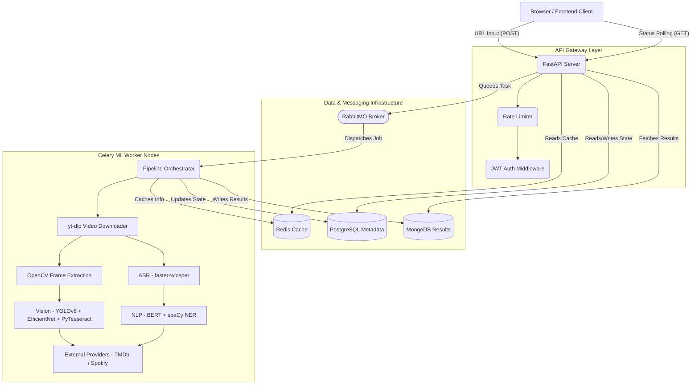

# 🎬 YouTube Intelligent Classifier

> AI-powered video analysis and structured content extraction.
> Multi-modal classification combining computer vision, speech-to-text, and NLP.

[](https://fastapi.tiangolo.com)
[](https://python.org)
[](https://react.dev)
[](https://docker.com)

---

## 📑 Table of Contents

1. [Project Overview](#project-overview)
2. [Key Features](#key-features)
3. [System Architecture](#system-architecture)
4. [Processing Workflow](#processing-workflow)
5. [Technical Stack](#technical-stack)
6. [Supported Video Categories](#supported-video-categories)
7. [API Reference](#api-reference)
8. [Project Structure](#project-structure)
9. [Success Metrics](#success-metrics)
10. [Local Development](#local-development)

---

## 🚀 Project Overview

The **YouTube Intelligent Classifier** is an enterprise-grade, asynchronous video processing pipeline designed to extract structured, actionable insights from raw YouTube videos. It employs a multi-modal artificial intelligence approach combining visual feature extraction (EfficientNet), object detection (YOLOv8), Optical Character Recognition (pytesseract), automatic speech recognition (Whisper), and natural language processing (BERT, spaCy). 

The platform is designed to categorize video content and extract highly specific metadata—such as timestamped product references for shopping, tracklists for music compilations, or structured chapters for educational content.

---

## ✨ Key Features

- **Multi-Modal Ensemble Classification**: Integrates visual frames and transcribed text to categorize videos securely and accurately.
- **Asynchronous Processing**: Driven by a robust `Celery` task queue backed by `RabbitMQ` and `Redis`, enabling scalable, fault-tolerant background processing.
- **Microservice-Oriented Architecture**: Clean separation between the high-throughput `FastAPI` API gateway, the React-based frontend, and the compute-heavy ML workers.
- **Rich Data Extraction**: Extracts highly structured data specific to video themes (e.g., dynamically aggregating shopping links, scraping movie ratings, or generating Spotify playlists).
- **Persistent Storage Strategy**: Metadata and job operational states are strictly enforced via `PostgreSQL`, while large, unbounded result payloads map safely into `MongoDB`.

---

## 🏛️ System Architecture

Below is the high-level architecture diagram demonstrating the interaction of the user interfaces, api gateways, and background execution contexts.



---

## ⚙️ Processing Workflow

The data processing pipeline is fully automated and functions across an 8-stage sequence:

1. **Job Initialization & Deduplication**: Ensures duplicate videos are retrieved directly from the database rather than redundantly processed. Status sets to `queued`.
2. **Media Ingestion**: utilizing `yt-dlp` to pull the optimal MP4 quality format into isolated temporary workspaces.
3. **Frame Sampling**: `OpenCV` samples visual frames iteratively based on temporal cadence constraints.
4. **Transcription**: Media audio is parsed through `faster-whisper` resolving timestamped segment-level textual transcriptions.
5. **Multi-Modal Categorization**: 
   - Transcribed text drives `DistilBERT` categorizations.
   - Extracted frames operate through `EfficientNet`. 
   - A weighted confidence ensemble (60% text, 40% visual) casts the deterministic outcome label.
6. **Granular Extraction**: Distinct extractors activate based on categorization:
   - For example, if classified as *shopping*, `YOLOv8` attempts object boundary detection, subsequently routed through `pytesseract` to scrape text. Entities are refined with `spaCy`.
7. **External Enrichment**: Augments local findings with third-party datasets (e.g., retrieving `Spotify` track IDs, indexing `TMDb` movie ratings).
8. **Final Persistence & Cleanup**: Assembles the monolithic JSON node, archives permanently inside `MongoDB`, toggles completion inside `PostgreSQL`, and purges local disk volume artifacts.

---

## 🛠️ Technical Stack

### **Backend Core**
- **Web Framework**: FastAPI, Uvicorn
- **Orchestration**: Celery, RabbitMQ
- **Data Layers**: PostgreSQL (Relational metadata), MongoDB (Document results), Redis (Broker/Caching)
- **Database ORM**: SQLAlchemy (Async), Alembic (Migrations)

### **Machine Learning & Extractors**
- **Computer Vision**: OpenCV, Ultralytics YOLOv8, PyTesseract, Torchvision EfficientNet
- **Speech & Language**: faster-whisper, Transformers (Hugging Face BERT), spaCy

### **Frontend Interface**
- **UI Framework**: React 18, Vite JS

---

## 📑 Supported Video Categories

The pipeline natively discriminates against eight primary thematic clusters, delivering specialized payloads respectively.

| Category | Extracted Output Capabilities |
|----------|-------------------------------|
| 🎭 **Comedy/Entertainment** | Timestamped punchlines, calculated sentiment arc, full segment transcript. |
| 📋 **Listicle/Ranking** | Sequentially ranked items injected with TMDb ratings & platform availability. |
| 🎵 **Music Compilation** | Track lists mapped securely with Spotify links alongside auto-playlist scripts. |
| 🎓 **Educational/Tutorial** | Auto-generated chapters, explicit key concept modeling, step-by-step extraction. |
| 📰 **News/Documentary** | Named entity recognition, explicit summarizations, and key point deductions. |
| ⭐ **Product Review** | Granular entity mapping, pros/cons derivations, timestamped shopping affiliations (e.g., Amazon, eBay). |
| 🎮 **Gaming/Esports** | Real-time game title recognitions, participant identification, chronological highlight markers. |
| 📹 **Vlog/Lifestyle** | Explicit topic segmentation, locational profiling, and human entity mentions. |

---

## 🔌 API Reference

Full interactive documentation is accessible at `http://localhost:8000/api/docs` upon spinning the cluster.

### 1. Submit Video Pipeline
```http
POST /api/v1/analyses/
Content-Type: application/json
Authorization: Bearer <JWT_TOKEN>

{
  "url": "https://www.youtube.com/watch?v=dQw4w9WgXcQ",
  "force_reanalysis": false
}
```

### 2. Poll Status Check
```http
GET /api/v1/analyses/{analysis_id}/status
Authorization: Bearer <JWT_TOKEN>
```

### 3. Retrieve Consolidated Results
```http
GET /api/v1/analyses/{analysis_id}/result
Authorization: Bearer <JWT_TOKEN>
```

### 4. Bulk Processing
```http
POST /api/v1/analyses/batch
Content-Type: application/json

{
  "urls": ["https://youtube.com/watch?v=abc", "https://youtube.com/watch?v=xyz"]
}
```

---

## 📂 Project Structure

```text
youtube-classifier/
├── backend/                       # Async FastAPI Python Infrastructure
│   ├── api/                       # Router definitions & Auth mechanisms
│   ├── core/                      # Environment and app-level configurations 
│   ├── db/                        # Async DB connectors (PG, Mongo, Redis)
│   ├── services/                  # Business Logic abstractions
│   │   ├── audio_processor/     
│   │   ├── classification/      
│   │   ├── extraction/          
│   │   ├── integration/         
│   │   ├── video_processor/     
│   │   └── vision/              
│   ├── celery.log                 # Distributed task logs
│   ├── main.py                    # Root FastAPI module
│   └── requirements.txt           # Verified Python pip dependency matrix
├── frontend/                      # React SPA Interface
│   ├── src/                       
│   └── vite.config.js             
├── scripts/                       # ML artifact retrievers and train harnesses
├── tests/                         # Pytest-native assertions (Unit/Integration)
└── docker/                        # Production & Development container manifests
```

---

## 🎯 Success Metrics

| Metric | Benchmark Target | Validation Protocol |
|---|---|---|
| **Classification Accuracy** | ≥ 85% | Cross-validated against 1000 labelled videos. |
| **Pipeline Latency** | ≤ 3 minutes | P95 observed duration spanning a 10-minute 1080p source. |
| **Transcription WER** | ≤ 10% | Assessed on Whisper medium via raw-clean benchmarking. |
| **Cluster Uptime** | ≥ 99.9% | Prometheus probing & AlertManager instrumentation. |
| **Test Coverage** | ≥ 90% | Assessed via standard `pytest-cov`. |

---

## 💻 Local Development

Please refer to the `SETUP.md` document residing in the root directory for a comprehensive, step-by-step local deployment guide tailored for natively provisioning elements such as Memurai, MongoDB, and PostgreSQL alongside the application servers.

*Developed as a Final Year Project — Computer Science & Engineering (August 2026).*
